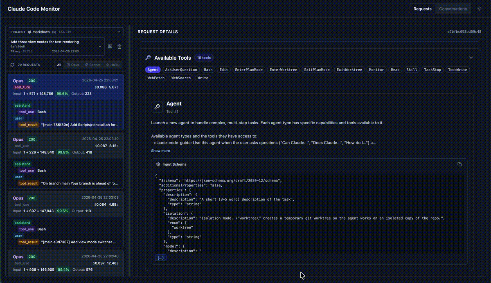

# Claude Code Proxy



A transparent proxy for capturing and visualizing in-flight Claude Code requests and conversations, with optional agent routing to different LLM providers.

## What It Does

Claude Code Proxy serves three main purposes:

1. **Claude Code Proxy**: Intercepts and monitors requests from Claude Code (claude.ai/code) to the Anthropic API, allowing you to see what Claude Code is doing in real-time
2. **Conversation Viewer**: Displays and analyzes your Claude API conversations with a beautiful web interface
3. **Agent Routing (Optional)**: Routes specific Claude Code agents to different LLM providers (e.g., route code-reviewer agent to GPT-4o)

## Features

- **Transparent Proxy**: Routes Claude Code requests through the monitor without disruption
- **Agent Routing (Optional)**: Map specific Claude Code agents to different LLM models (OpenAI `gpt-*`/`o1`/`o3` supported out of the box)
- **Request Monitoring**: SQLite-based logging of all API interactions, grouped by Claude Code session ID
- **Session-aware Dashboard**: Sidebar switcher between sessions/projects with live titles pulled from Claude Code's `~/.claude/projects/*.jsonl`
- **Conversation Analysis**: View full conversation threads with tool usage, message flow, and code diffs
- **Cross-linking**: Jump between a session's requests and its Claude Code conversation in one click
- **Sensitive Header Hashing**: API keys and auth headers are SHA256-hashed before being written to the request log (toggleable for local debugging)
- **Easy Setup**: One-command startup for both services

## Quick Start

### Prerequisites
- **Option 1**: Go 1.20+ and Node.js 20+ (for local development — Remix v2 + Vite 6 require Node ≥ 20)
- **Option 2**: Docker (for containerized deployment)
- Claude Code

### Installation

#### Option 1: Local Development

1. **Clone the repository**
   ```bash
   git clone https://github.com/seifghazi/claude-code-proxy.git
   cd claude-code-proxy
   ```

2. **Configure the proxy**
   ```bash
   cp config.yaml.example config.yaml
   ```

3. **Install and run** (first time)
   ```bash
   make install  # Install all dependencies
   make dev      # Start both services
   ```

4. **Subsequent runs** (after initial setup)
   ```bash
   make dev
   # or
   ./run.sh
   ```

#### Option 2: Docker

1. **Clone the repository**
   ```bash
   git clone https://github.com/seifghazi/claude-code-proxy.git
   cd claude-code-proxy
   ```

2. **Configure the proxy**
   ```bash
   cp config.yaml.example config.yaml
   # Edit config.yaml as needed
   ```

3. **Build and run with Docker**
   ```bash
   # Build the image
   docker build -t claude-code-proxy .
   
   # Run with default settings
   docker run -p 3001:3001 -p 5173:5173 claude-code-proxy
   ```

4. **Run with persistent data and custom configuration**
   ```bash
   # Create a data directory for persistent SQLite database
   mkdir -p ./data
   
   # Option 1: Run with config file (recommended)
   docker run -p 3001:3001 -p 5173:5173 \
     -v ./data:/app/data \
     -v ./config.yaml:/app/config.yaml:ro \
     claude-code-proxy
   
   # Option 2: Run with environment variables
   docker run -p 3001:3001 -p 5173:5173 \
     -v ./data:/app/data \
     -e ANTHROPIC_FORWARD_URL=https://api.anthropic.com \
     -e PORT=3001 \
     -e WEB_PORT=5173 \
     claude-code-proxy
   ```

5. **Docker Compose (alternative)**
   ```yaml
   # docker-compose.yml
   version: '3.8'
   services:
     claude-code-proxy:
       build: .
       ports:
         - "3001:3001"
         - "5173:5173"
       volumes:
         - ./data:/app/data
         - ./config.yaml:/app/config.yaml:ro  # Mount config file
       environment:
         - ANTHROPIC_FORWARD_URL=https://api.anthropic.com
         - PORT=3001
         - WEB_PORT=5173
         - DB_PATH=/app/data/requests.db
   ```
   
   Then run: `docker-compose up`

### Using with Claude Code

To use this proxy with Claude Code, set:
```bash
export ANTHROPIC_BASE_URL=http://localhost:3001
```

Then launch Claude Code using the `claude` command.

This will route Claude Code's requests through the proxy for monitoring.

### Access Points
- **Web Dashboard**: http://localhost:5173
- **API Proxy**: http://localhost:3001
- **Health Check**: http://localhost:3001/health

## Advanced Usage

### Running Services Separately

If you need to run services independently:

```bash
# Run proxy only
make run-proxy

# Run web interface only (in another terminal)
make run-web
```

### Available Make Commands

```bash
make install    # Install all dependencies
make build      # Build both services
make dev        # Run in development mode
make clean      # Clean build artifacts
make db-reset   # Reset database
make help       # Show all commands
```

## Configuration

### Basic Setup

Create a `config.yaml` file (or copy from `config.yaml.example`):
```yaml
server:
  port: 3001

providers:
  anthropic:
    base_url: "https://api.anthropic.com"
    max_retries: 3

  openai: # if enabling subagent routing
    api_key: "your-openai-key"  # Or set OPENAI_API_KEY env var
    # base_url: "https://api.openai.com"  # Or set OPENAI_BASE_URL env var

security:
  # Hash sensitive headers (x-api-key, authorization, etc.) with SHA256
  # before writing to the request log. Set to false only for local debugging.
  sanitize_headers: true

storage:
  db_path: "requests.db"
```

### Subagent Configuration (Optional)

The proxy supports routing specific Claude Code agents to different LLM providers. This is an **optional** feature that's disabled by default.

#### Enabling Subagent Routing

1. **Enable the feature** in `config.yaml`:
```yaml
subagents:
  enable: true  # Set to true to enable subagent routing
  mappings:
    code-reviewer: "gpt-4o"
    data-analyst: "o3"
    doc-writer: "gpt-3.5-turbo"
```

2. **Set up your Claude Code agents** following Anthropic's official documentation:
   - 📖 **[Claude Code Subagents Documentation](https://docs.anthropic.com/en/docs/claude-code/sub-agents)**

3. **How it works**: When Claude Code uses a subagent that matches one of your mappings, the proxy will automatically route the request to the specified model instead of Claude.

### Practical Examples

**Example 1: Code Review Agent → GPT-4o**
```yaml
# config.yaml
subagents:
  enable: true
  mappings:
    code-reviewer: "gpt-4o"
```
Use case: Route code review tasks to GPT-4o for faster responses while keeping complex coding tasks on Claude.

**Example 2: Reasoning Agent → O3**  
```yaml
# config.yaml
subagents:
  enable: true
  mappings:
    deep-reasoning: "o3"
```
Use case: Send complex reasoning tasks to O3 while using Claude for general coding.

**Example 3: Multiple Agents**
```yaml
# config.yaml
subagents:
  enable: true
  mappings:
    streaming-systems-engineer: "o3"
    frontend-developer: "gpt-4o-mini"
    security-auditor: "gpt-4o"
```
Use case: Different specialists for different tasks, optimizing for speed/cost/quality.

### Environment Variables

Override config via environment:
- `PORT` — Proxy server port
- `READ_TIMEOUT` / `WRITE_TIMEOUT` / `IDLE_TIMEOUT` — Go duration strings (default `600s`)
- `ANTHROPIC_FORWARD_URL` — Upstream Anthropic API URL
- `ANTHROPIC_VERSION` — `anthropic-version` header (default `2023-06-01`)
- `ANTHROPIC_MAX_RETRIES` — Maximum retry attempts
- `OPENAI_API_KEY` / `OPENAI_BASE_URL` — OpenAI credentials for subagent routing
- `DB_PATH` — SQLite database path
- `SUBAGENT_MAPPINGS` — Comma-separated mappings (e.g., `"code-reviewer:gpt-4o,data-analyst:o3"`)
- `WEB_PORT` — Remix web port (Docker only)

### Docker Environment Variables

All environment variables can be configured when running the Docker container:

| Variable | Default | Description |
|----------|---------|-------------|
| `PORT` | `3001` | Proxy server port |
| `WEB_PORT` | `5173` | Web dashboard port |
| `READ_TIMEOUT` | `600` | Server read timeout (seconds) |
| `WRITE_TIMEOUT` | `600` | Server write timeout (seconds) |
| `IDLE_TIMEOUT` | `600` | Server idle timeout (seconds) |
| `ANTHROPIC_FORWARD_URL` | `https://api.anthropic.com` | Target Anthropic API URL |
| `ANTHROPIC_VERSION` | `2023-06-01` | Anthropic API version |
| `ANTHROPIC_MAX_RETRIES` | `3` | Maximum retry attempts |
| `DB_PATH` | `/app/data/requests.db` | SQLite database path |

Example with custom configuration:
```bash
docker run -p 3001:3001 -p 5173:5173 \
  -v ./data:/app/data \
  -e PORT=8080 \
  -e WEB_PORT=3000 \
  -e ANTHROPIC_FORWARD_URL=https://api.anthropic.com \
  -e DB_PATH=/app/data/custom.db \
  claude-code-proxy
```


## Project Structure

```
claude-code-proxy/
├── proxy/                 # Go proxy server (module: github.com/seifghazi/claude-code-monitor)
│   ├── cmd/proxy/         # Entry point — HTTP server + SessionIndex lifecycle
│   └── internal/
│       ├── config/        # YAML + ENV config loader
│       ├── handler/       # HTTP handlers (Messages, Sessions, Projects, Conversations)
│       ├── middleware/    # Request logging + body capture
│       ├── model/         # Request/response DTOs
│       ├── provider/      # Anthropic + OpenAI provider implementations
│       └── service/       # ModelRouter, SessionIndex, SQLiteStorage, Conversation parser
├── web/                   # Remix v2 + Vite 6 frontend (Node ≥ 20)
│   └── app/
│       ├── routes/        # /requests, /requests/:sid, /conversations, /conversations/:pid, /api/*
│       └── components/    # TopNav, SessionPicker, ProjectPicker, HorizontalSplit, etc.
├── config.yaml.example    # Config template
├── Dockerfile             # 3-stage build (go-builder + node-builder + runtime)
├── docker-entrypoint.sh   # Runs proxy + remix-serve in one container
├── run.sh                 # Local dev starter
├── Makefile               # install / build / dev / clean / db-reset
├── .refs/project-map.md   # Full codebase map for Claude Code sessions
└── README.md              # This file
```

## Features in Detail

### Request Monitoring
- All API requests logged to SQLite, tagged with the `X-Claude-Code-Session-Id` header
- Requests without a session ID fall into an `unknown` bucket
- Session-level delete from the sidebar row (jsonl conversation files are never touched from the UI)
- Request/response body inspection including streaming chunk reconstruction

### Session ↔ Conversation Linking
The proxy watches `~/.claude/projects/*.jsonl` with `fsnotify` (falls back to 10s polling) and keeps an in-memory `SessionIndex` mapping each session ID to its project path, display name, and title. The dashboard uses this to:
- Show the project/title next to each session in the sidebar
- Disable the "open conversation" shortcut when no jsonl file exists for a session
- Refresh titles as Claude Code writes new `ai-title` / `custom-title` lines

### Database Schema Changes

This project does not perform schema migrations. When the database schema is
changed (for example, a new column is added to the `requests` table), delete
the existing SQLite file and restart the server so the table is recreated:

```bash
rm -f proxy/requests.db   # or whatever DB_PATH points to
make dev
```

On Docker, remove the mounted `./data/requests.db` file instead.

### Web Dashboard
- Real-time request streaming
- Interactive request explorer with model filter
- Conversation visualization with tool use, diffs, and images
- Resizable 2-column splitter per view (state resets on each mount — not persisted)

#### Routes
- `/` — redirects to `/requests`
- `/requests` — auto-redirects to the most recent session
- `/requests/:sessionId` — left: session picker + request list with model filter; right: request detail. `sessionId = unknown` selects requests with no session header. Selected request and model filter are stored in `?rid=` / `?model=` so reloads preserve the view.
- `/conversations` — auto-redirects to the most recent project
- `/conversations/:projectId` — left: project picker + conversation list; right: conversation thread. Selected conversation is stored in `?sid=`.

Each row in the requests sidebar has a delete button (removes that session's rows from SQLite). The conversations sidebar has no delete — `.jsonl` files under `~/.claude/projects/` are read-only from the UI. Titles come from Claude Code's own `ai-title` / `custom-title` events; sessions without a matching jsonl show "Project Not Found" and disable the cross-link button.

## License

MIT License - see [LICENSE](LICENSE) for details.
